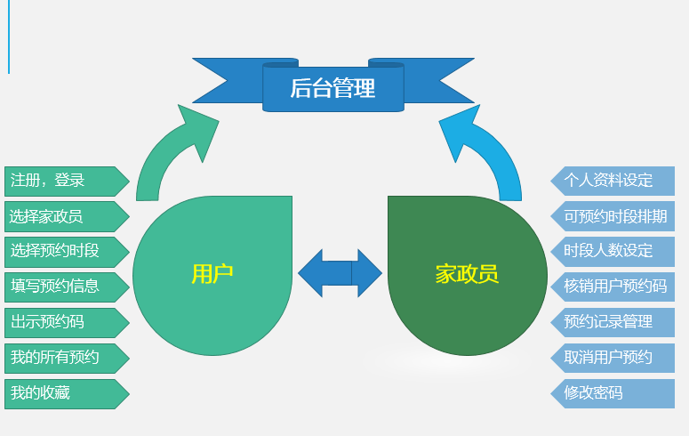

## 功能介绍 

- 上门保洁小程序：可以让消费者通过小程序进行保洁服务预约，在线下单，预约上门服务时间；小程序不仅可以为各大家政公司提供便利，还为个人保洁人员提供接单平台。个人保洁人员在线提交审核所需资料，通过审核就能成为平台工作人员，进行接单，实现经济自由；家政公司内有不同等级的保洁工作人员，按照工作能力不同分为：普通、银牌、金牌三种不同等级，等级越高工作能力越强，费用越高，用户可以选择自己需要的服务等级、服务时间。还能在预订时备注上其他的个人要求
- 包含用户端，家政员端，管理端三方，能够清晰展现家政服务项目内容和价格，将服务步骤条理化、透明度，让潜在的用户能够足不出门地就掌握到服务信息内容，有益于降低供求间的信息差，

- 本项目前后端完整，包括公告，家政员预约，后台管理，用户管理，预约名单管理，预约记录管理与导出，我的预约，历史浏览，我的收藏等模块，采用腾讯提供的小程序云开发解决方案，无须服务器和域名。

本项目分为用户端，家政员端，后台端3个组成部分：
- 后台端：可以添加和设定家政员的基本信息，账号，登陆密码等。
- 家政员端：可以编辑自己的个人资料（头像，简介，星级等），设定预约时段排期（可预约时段，各时段人数限定）， 在现场核销用户的预约码。
- 用户端：选择自己需要的家政员和时段，下单预约，当到家政员上门时出示预约码给家政员核销。

.jpg)

## 技术运用
- 本项目使用微信小程序平台进行开发。
- 使用腾讯专门的小程序云开发技术，云资源包含云函数，数据库，带宽，存储空间，定时器等，资源配额价格低廉，无需域名和服务器即可搭建。
- 小程序本身的即用即走，适合小工具的使用场景，也适合快速开发迭代。
- 云开发技术采用腾讯内部链路，没有被黑客攻击的风险，不会 DDOS攻击，节省防火墙费用，安全性高且免维护。
- 资源承载力可根据业务发展需要随时弹性扩展。  

## 作者
- 如有疑问，欢迎骚扰联系我：开发交流，技术分享，问题答疑，功能建议收集，版本更新通知，安装部署协助，小程序开发定制等。
- 俺的微信: 
 

## 演示 
 

## 安装

- 安装手册见源码包里的word文档

## 用户端截图

 

## 家政员端截图

## 后台管理系统截图 
- 后台超级管理员默认账号:admin，密码123456，请登录后台后及时修改密码和创建普通管理员。

